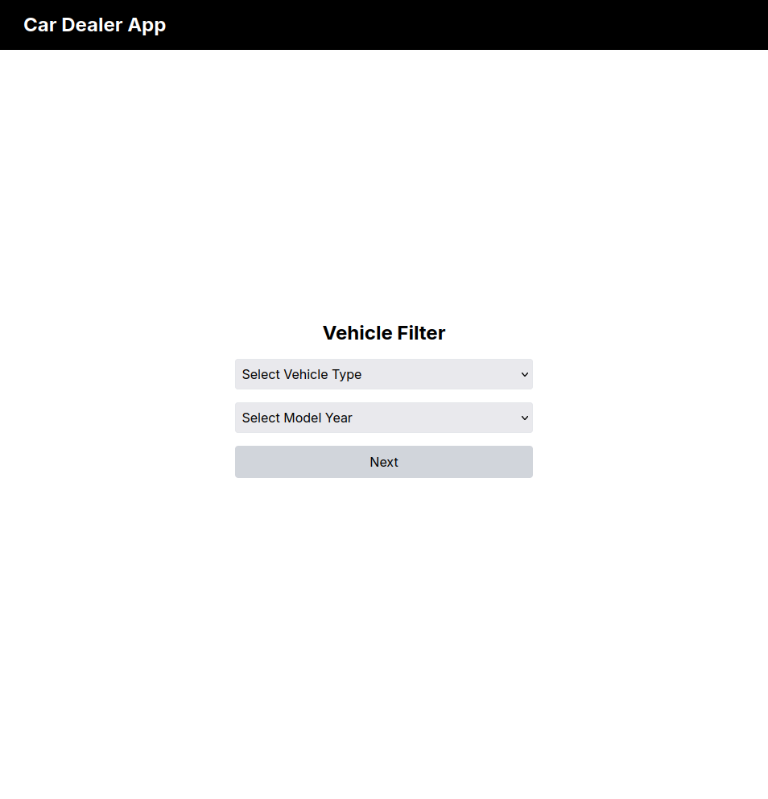
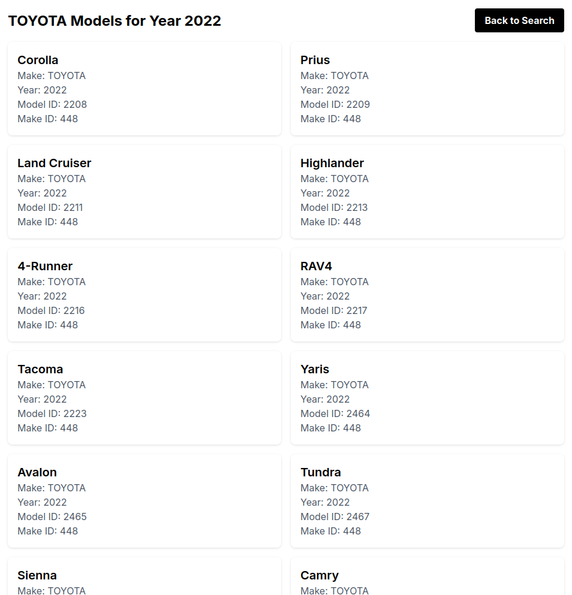

# Car Dealer App

This is a Next.js application that allows users to search for vehicle models by make and year.

## Features

- Search for vehicle models by make and year
- Display detailed information about each vehicle model
- Responsive design using Tailwind CSS

## Getting Started

### Prerequisites

- Node.js 14.0 or later
- npm

### Installation

1. Clone the repository:
   ```
   git clone https://github.com/gabrielbiscaia/car-dealer-app.git
   ```

2. Navigate to the project directory:
   ```
   cd car-dealer-app
   ```

3. Install dependencies:
   ```
   npm install
   ```

4. Create a `.env.local` file in the root directory and add the following:
   ```
   NEXT_PUBLIC_API_URL=https://vpic.nhtsa.dot.gov/api
   ```

### Running the Application

1. Start the development server:
   ```
   npm run dev
   ```

2. Open [http://localhost:3000](http://localhost:3000) in your browser.

## Building for Production

To create a production build:

```
npm run build
```

Then, to start the production server:

```
npm start
```

## Technologies Used

- Next.js
- React
- Tailwind CSS
- TypeScript

## Project Structure

- `src/app`: Contains the main application pages
- `src/components`: Reusable React components
- `public`: Static assets

## Screens

### Home Page


### Vehicles filtered by "Make" and "Year"
